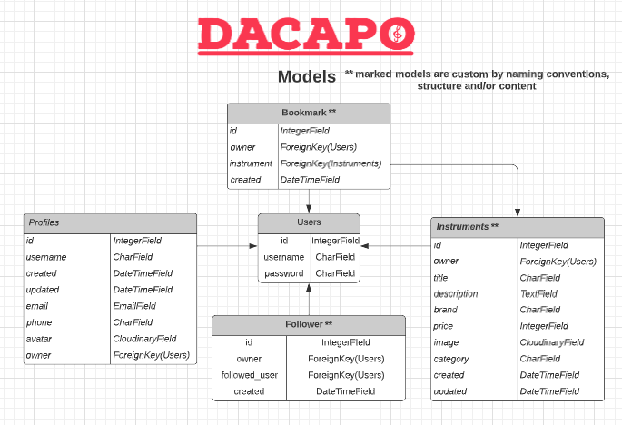
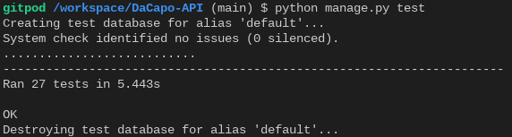

# DaCapo RESTful API
## The backend API for the DaCapo React Project

[Click here for the API access](https://dacapo-api.herokuapp.com/)

## Frontend Project (React)
[Click here to see the frontend repository](https://)

## Table of contents
1. [Introduction](#introduction) 
2. [Preparation](#preparation)
3. [Development](#development)
4. [CRUD](#crud)
5. [Testing](#testing)
6. [Deployment](#deployment) 
7. [Notes](#notes) 
8. [Credits / attributes](#credits) 

## Introduction 
This repository is used for version control and documentation of the DaCapo-API development process. In the following sections, general information about the approach and the different functionalities of the interface are listed, such as the schema design (models), manual and automatic testing, CRUD operations, deployment process, etc. 

## Preparation
In terms of preparation for API development, many issues played a role: 
* Which data should be queried / stored? What is really necessary, or perhaps even redundant? 
* How should this data be structured and built? What are the constraints on the data fields? 
* How do data models relate to each other? Which dependencies exist? 
* What do the permissions look like? What are non-authorized visitors allowed to do and what not? 

In order to get an answer to these and several other questions, the data model was visualized using an entity relational diagram. This is the quickest way to visualize the schema design.

The creation of the ERD was actually the first step and was used as a guide during development. 
 
## Development

The development process was aligned with the ERD as described, whereby the ERD was essentially determined by the user stories of the frontend. From this point of view, all functions and options of the frontend were the source of ideas for the backend development and must therefore not be omitted at this point: 

[Click here to see the user stories of the frontend](https://)

In the following, the development process is described in more detail: 
The DRF repository and project were started first. To directly cover all security measures, environment variables (secret key and cloudinary url) were created and committed only after updating the settings. This ensured that no sensitive content was published. 

Subsequently, the profiles, instruments, bookmarks followers, wanted and rating apps were designed, one after the other. It was avoided to work synchronously on different apps and to finish first one app completely. This has some advantages: 
* Focus on the content and increased concentration
* Better overview (less open tabs in the editor)
* Faster development

The individual steps of the app development always followed the same sequence: 
* Development of the model according to ERD specifications
* Creation of the serializer
* Creation of the views and the corresponding URLs
* updating the main URL patterns

At first, the views were supposed to use the APIView to write more explicit code, but due to time constraints, generic views were used in the further course. These achieve the same with much less code and time. To create uniformity, all views that used the API view were refactored. 

Once the base of all apps was in place, more features were added towards the end of API development. These included among others: 
* Implementation of count method in bookmarks, followers and instruments to show the current state of the data.
* The use of a search field for instruments.
* The creation of filters in instruments and profiles (e.g. filter by instrument category or by popularity).
* Pagination.
* Cosmetic changes like the DateTime format.
* The development of a compressed root url with useful hints (endpoints). 
* The addition of the rating and wanted apps, which were added after the project was actually done, because these functionalites would be nice to have (and to guarantee custom models).

Before deployment, however, the JSON web tokens and authentication still had to be set up. 
Besides installing the required dependencies (e.g. rest_framework.authtoken, dj_rest_auth, allauth etc.) the settings were adjusted to define the variable "REST_FRAMWORK" and the JWT variables. 

To enable hosting on Heroku or an API in production, the creation of a database was still necessary. A PostgreSQL database was created on elephantsql.com and included in the environment variables. Data store configuration is kept in a single location (in settings.py) and therefore is easily maintainable.

Last but not least, automatic tests were written for each app (except profiles). You can find more about this in the testing section of this documentation. Therefore, it was not a classic TDD approach, but these tests are still very helpful to quickly check the functionality of the API in an extension. 

## CRUD

Although the CRUD functionalities can be found at the top of the documentation (root route), they are summarized here once again in a clear manner. Users can: 

* create a profile.
* list all profiles.
* retrieve a profile and update their own.
* list all instruments and create a new instrument.
* retrieve a single instrument and retrieve and delete their own entries. 
* retrieve, create and delete a bookmark if they are authenticated.
* retrieve, create and delete a following entry if they are authenticated. 
* list the rating overview and create a rating for a user
* retrieve a single rating, update and delete it if authenticated.
* list and create a wanted item.
* get, update and delete a wanted item, if you are the owner.

## Testing 

The API was tested manually as well as automatically. For a better overview, these two areas are now treated separately from each other. 

**Manual testing**

Manual testing of the API was done in development mode to get the useful feedback from django on bugs. The built-in django API user interface was used to run through all possible scenarios. Via the terminal 3 users were created, who then created different instruments, then updated or deleted them. The fictitious users interacted via the bookmark, follow and rating function and no logical errors, bugs or anomalies were found. 

Apart from a few typos, there were no major errors during development. The biggest and most time consuming error was a wrong setting during the deployment. 

This resulted in a 400 status code when launching the API. It turned out relatively quickly that this was due to the wrong specification of the allowed host. 

**Automatic testing**

A test suite was also written for each app. The profiles app is excluded from this because it is used in conjunction with the other apps anyway and is therefore tested and because a crucial operation, namely the creation of profiles, takes place with django signals. A test suite therefore seemed rather inappropriate. 

For the instruments, bookmarks, followers, wanted and rating app the following tests were written:

**Instruments**
* can view instruments
* logged in user can create instrument
* user not logged in cant create instrument
* can get item using valid id
* cant get item using invalid id
* user can update own item
* user cant update foreign item

**Bookmarks**
* can view bookmarks
* logged in user can create bookmark
* user not logged in cant create bookmark 
* user logged in can delete bookmark 

**Follower**
* can view followers
* logged in user can follow user
* user not logged in cant follow user
* user logged in can unfollow user

**Wanted**
* can view wanted
* logged in user can created wanted
* user not logged in cant create wanted
* can get wanted using valid id 
* cant get wanted using invalid id
* user can update own wanted
* user cant update foreign wanted

**Rating**
* can view rating
* logged in user can rate users
* user not logged in cant rate user
* user logged in can delete rating
* user logged in can update rating

These tests do not claim to be complete or to cover 100% of all cases, which no suite should do, as unexpected cases can always occur. However, they do provide a robust framework, making the API resilient to many errors. If, while you read this documentation, you notice that important, critical tests are missing, I would appreciate feedback. You can find all the tests in the specific app folder under tests.py.

The suite consists of 27 tests, all of which pass at the time of project release.

## Deployment 

In order to deploy the app on Heroku, a few steps had to be taken in advance. The integration of JSON web tokens and other related steps have already been covered under "development", which is why I will not go into more detail here, but rather focus on the actual deployment. 

The individual steps involved were: 
- Creation of a PostgreSQL database on elephantsql.com
- Creation of a Heroku App and the integration of the database with the help of an environment variable (DATABASE_URL) as well as definition of further variables: CLOUDINARY_URL, DISABLE_COLLECTSTATIC, SECRET_KEY and ALLOWED_HOST.
- Installation of further dependencies: dj_database_url, psycopg2, gunicorn, django-cors-headers
- Editing settings.py and env.py: configuring the DATABASE variables, setting up the DATABASE_URL environment variable
- Database migration
- Creation of a Procfile
- Editing the allowed hosts
- Insertion of the cors-headers in installed apps and middleware 
- Definition of CLIENT_ORIGIN
- Update of requirements.txt 

Only one error occurred during deployment, which has already been dealt with under manual testing. No other problems occurred. 

[Click here for the deployed API](https://dacapo-api.herokuapp.com/)

## Notes

**PEP8**

All files conform to the PEP8 style guidelines. The exception to this is settings.py (list of AUTH_PASSWORD_VALIDATORS), as this is already created this way. In order not to endanger the integrity of the app, the lines were not shortened, but left as they are. 

**Naming conventions**

In the API project, you can see that the apps are always defined in the plural form (instruments, bookmarks etc.), except rating and wanted, which was done intentionally. There is no plural of "wanted" and the ratings are understood as a global rating, hence the singular. When using the urls you should pay attention to this change!  It is therefore not a break with the conventions, but circumstances that do not allow it otherwise. 

**Security**

In the course of the creation of this API, attention was paid to security at all times. All sensitive information (e.g. secret key) is stored in environment variables and at no time was the project deployed to Heroku with sensible / critical information accessible. 

**Requirements**

asgiref==3.6.0

cloudinary==1.30.0

dj-database-url==0.5.0

dj-rest-auth==2.2.5

Django==3.2.16

django-allauth==0.50.0

django-cloudinary-storage==0.3.0

django-cors-headers==3.13.0

django-filter==22.1

djangorestframework==3.14.0

djangorestframework-simplejwt==5.2.2

gunicorn==20.1.0

oauthlib==3.2.2

Pillow==9.3.0

psycopg2==2.9.5

PyJWT==2.6.0

python3-openid==3.2.0

pytz==2022.7

requests-oauthlib==1.3.1

sqlparse==0.4.3

**Custom models**

The API consists of at least 3 custom models. These are: Instrument, Rating and Wanted. 
You could even argue there are 5 custom models. 

According to the definition, custom models that have either been created completely by the student, or previously used models that have been modified / altered. 

Instruments, Wanted and Rating are models that I created myself. The models in bookmarks and followers were modified to meet my needs. To what extent have they been modified? Mainly the structure in the code is different. This is because I tried to learn everything by heart and not copy anything blindly. 
So imports, expressions and the general arrangement are completely different. Also, other (variable-) names were used to make the code more readable. This makes them fundamentally different from the already known models, although there are also many similarities.

The main reason for this is the declarative language of the Django Rest framework and the fact that a lot is done "under the hood" by Django. 

## Credits

At this point I would like to thank the Code Institute instructors and team for providing the materials for Django REST Framework. The lessons were a good guide for building this API. 

Also, the ensuing documentation from DRF was frequently referenced: https://www.django-rest-framework.org/

I also want to give credit to Timur Bakibayev, author of the following article: https://medium.com/geekculture/django-implementing-star-rating-e1deff03bb1c. The idea to implement a rating model in a specific way was derived from this article. 