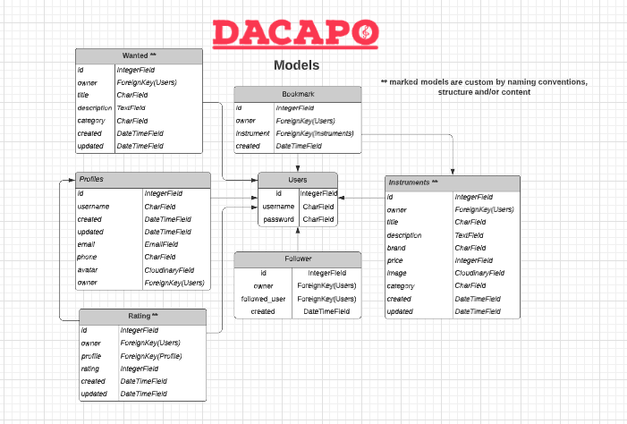

# DaCapo RESTful API
## The backend API for the DaCapo React Project

[Click here for the full website access](https://dacapo-api.herokuapp.com/)

## Frontend Project (React)
[Click here to see the frontend repository](https://)

## Table of contents
1. [Introduction](#introduction) 
2. [Preparation](#preparation)
3. [Development](#development)
4. [CRUD](#crud)
5. [Testing](#testing)
6. [Deployment](#deployment) 
7. [Notes](#notes) 
8. [Credits / attributes](#credits) 

## Introduction 
This repository is used for version control and documentation of the DaCapo-API development process. In the following sections, general information about the approach and the different functionalities of the interface are listed, such as the schema design (models), manual and automatic testing, CRUD operations, deployment process, etc. 

## Preparation
In terms of preparation for API development, many issues played a role: 
* Which data should be queried / stored? What is really necessary, or perhaps even superfluous? 
* How should this data be structured and built? What are the constraints on the data fields? 
* How do data models relate to each other? Which dependencies exist? 
* What do the permissions look like? What are non-authorized visitors allowed to do and what not? 

In order to get an answer to these and several other questions, the data model was visualized using an entity relational diagram. This is the quickest way to visualize the schema design.

 
search, filter

## Development

## CRUD

## Testing 

The API was tested manually as well as automatically. For a better overview, these two areas are now treated separately from each other. 

**Manual testing**

**Automatic testing**

The suite consists of 15 tests, all of which pass at the time of project release.

## Deployment 

[You can access the deployed version right here](https://)

## Notes

**Security**

In the course of the creation attention was paid to security at all times. All sensitive information is stored in environment variables and at no time was the project deployed to Heroku with sensible / critical information accessible. 

**Requirements**

**Custom models**

## Credits
