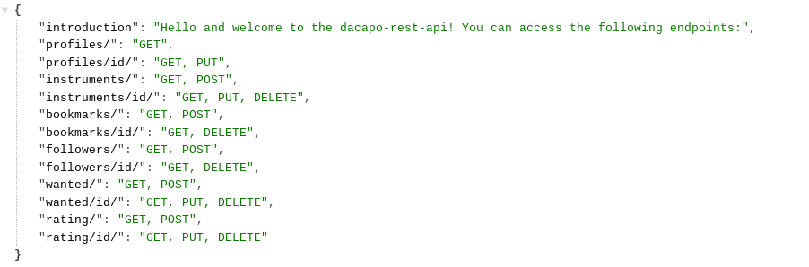

# DaCapo RESTful API
## The backend API for the DaCapo React Project

[Click here for the full website access](https://dacapo-api.herokuapp.com/)

## Table of contents
1. [Introduction](#introduction) 
2. [Preparation](#preparation)
3. [Development](#development)
4. [CRUD](#crud)
5. [Testing](#testing)
6. [Deployment](#deployment) 
7. [Notes](#notes) 
8. [Credits / attributes](#credits) 

## Introduction 

## Preparation

schema design 
search, filter

## Development

## CRUD

## Testing 

The API was tested manually as well as automatically. For a better overview, these two areas are now treated separately from each other. 

**Manual testing**

**Automatic testing**

The suite consists of 15 tests, all of which pass at the time of project release.

## Deployment 

[You can access the deployed version right here](https://)

## Notes

**Security**

In the course of the creation attention was paid to security at all times. All sensitive information is stored in environment variables and at no time was the project deployed to Heroku with sensible / critical information accessible. 

**Requirements**

**Custom models**

## Credits
